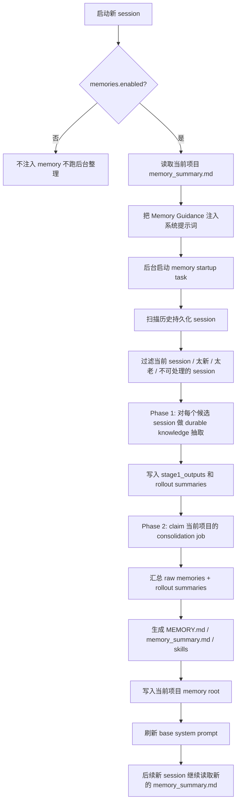

## 1. 先说结论

Oh My Pi 的 memory 不是“把全部聊天历史永久塞进上下文”的机制，也不是向量检索库。

它更接近一个**项目级长期记忆整理器**：

1. 新 session 启动时，把当前项目已有的 `memory_summary.md` 注入系统提示词
2. 后台扫描这个项目过去的持久化 session
3. 先逐个 session 提炼 durable knowledge
4. 再把这些提炼结果汇总成长期记忆文件和 skills
5. 之后新 session 再启动时，继续读取这份总结后的记忆

一句话：**OMP memory = 项目级、两阶段、文件化的长期经验系统。**

---

## 2. 它到底记什么

memory 目标不是保存所有对话细节，而是保存“以后还值得复用”的信息。

重点保留：

- 技术决策
- 约束条件
- 常用工作流
- 坑点
- 已解决过的失败模式
- 对当前项目长期有效的习惯和流程

尽量丢弃：

- 闲聊
- 一次性临时内容
- 低信号噪音
- 过长、没有复用价值的工具输出

对应提示词：

- `packages/coding-agent/src/prompts/memories/stage_one_system.md`
- `packages/coding-agent/src/prompts/memories/consolidation.md`

---

## 3. 启动时怎么生效

当 `memories.enabled = true` 时，OMP 会在构建系统提示词时尝试读取当前项目 memory root 下的 `memory_summary.md`，然后把它渲染成一段 `Memory Guidance` 附加到系统提示词里。

关键入口：

- `packages/coding-agent/src/memories/index.ts`
  - `buildMemoryToolDeveloperInstructions(...)`
- `packages/coding-agent/src/sdk.ts`
  - 构建 append prompt 时把 memory instructions 拼进去

注入后的规则不是“无条件相信记忆”，而是：

1. 先读 `memory://root/memory_summary.md`
2. memory 只算启发式上下文
3. 当前仓库状态、运行结果、用户指令优先级更高
4. 如果 memory 影响了行动计划，必须结合当前仓库证据验证

所以 memory 更像“历史经验提示”，不是事实数据库。

---

## 4. 什么时候会跑 memory 管线

memory 管线在 session 启动时后台触发：

- `packages/coding-agent/src/memories/index.ts`
  - `startMemoryStartupTask(...)`
- 调用点：`packages/coding-agent/src/sdk.ts`

但它不会在所有场景都运行。代码里会跳过这些情况：

- `memories.enabled` 没开
- 当前是 subagent/task 深层执行
- 当前 session 没有持久化 session 文件

这点很关键：**memory 依赖持久化 session，不是所有临时会话都会积累长期记忆。**

---

## 5. 两阶段处理流程

## Phase 1：逐 session 抽取

入口：

- `runPhase1(...)`
- `runStage1Job(...)`

行为：

1. 扫描历史 session `.jsonl`
2. 跳过当前活跃 session
3. 跳过太新的 session
4. 跳过太老的 session
5. 跳过没有 durable signal 的 session
6. 对每个候选 session 调模型，抽取结构化输出

输出契约：

```json
{
  "rollout_summary": "string",
  "rollout_slug": "string | null",
  "raw_memory": "string"
}
```

默认筛选参数：

- `memories.maxRolloutsPerStartup = 64`
- `memories.maxRolloutAgeDays = 30`
- `memories.minRolloutIdleHours = 12`

## Phase 2：全项目汇总

入口：

- `runPhase2(...)`
- `runConsolidationModel(...)`

行为：

1. 读取 Phase 1 产出的 `raw_memory` 和 rollout summary
2. 再做一次全局 consolidation
3. 产出长期记忆文档和 skills
4. 清理已经过期、应当被删除的旧 skill 文件

最终写盘产物：

- `MEMORY.md`
- `memory_summary.md`
- `skills/<name>/SKILL.md`
- `skills/<name>/scripts/...`
- `skills/<name>/templates/...`
- `skills/<name>/examples/...`

---

## 6. 生命周期流程图



如果不用 Mermaid，看文字版：

```text
新 session 启动
  -> 读取 memory_summary.md 并注入 system prompt
  -> 后台扫描历史 session
  -> Phase 1 抽取每个 session 的 durable memory
  -> Phase 2 汇总所有 raw memories
  -> 写回 MEMORY.md / memory_summary.md / skills
  -> 之后新的 session 再读取更新后的 memory_summary.md
```

---

## 7. 记忆文件放哪

用户级目录：

- `~/.omp/agent/memories`

但 OMP 不是把所有项目混在一起，而是按**项目 cwd**隔离。

对应代码：

- `packages/utils/src/dirs.ts`
- `packages/coding-agent/src/memories/index.ts`
  - `getMemoryRoot(...)`

所以每个项目都有独立 memory root，避免不同仓库之间串台。

仓库里还有专门测试这个隔离逻辑：

- `packages/coding-agent/test/memories/isolation.test.ts`

---

## 8. 内部状态怎么存

除了 markdown 产物，OMP 还会在 `agent.db` 里维护 memory 状态。

SQLite 表主要有三类：

- `threads`
- `stage1_outputs`
- `jobs`

对应代码：

- `packages/coding-agent/src/memories/storage.ts`

这些表负责记录：

- 哪些 session 已被扫描
- 哪些 session 需要重试
- Phase 2 consolidation 是否正在跑
- 当前项目跑到了哪个 watermark

所以 memory 既有“文件侧产物”，也有“数据库侧调度状态”。

---

## 9. 并发、隔离和安全

### 9.1 项目隔离

Phase 2 的 global job 不是单个全局 key，而是和 `cwd` 绑定的 job key。

含义：

- 项目 A 的 consolidation 不会把项目 B 的 raw memories 混进去
- 同一台机器上多个项目可以各自维护独立 memory

### 9.2 lease / heartbeat

Phase 2 运行前会先 claim job，并通过 heartbeat 延长租约。

作用：

- 防止多个 OMP 进程同时对同一个项目做 consolidation
- 防止双写和竞争覆盖

### 9.3 secrets 脱敏

memory 写盘前会走简单的 secret redaction。

代码会尝试清理：

- token
- secret
- password
- AWS key
- 类 JWT 片段

所以它不是直接把所有原文原样抄进长期记忆文件。

---

## 10. 哪些消息会进入 memory 抽取

不是整个 session 无差别进入。

Phase 1 里会优先保留这些消息：

- `system`
- `developer`
- `user`
- `assistant`

以及部分工具结果，但只限：

- `bash`
- `python`
- `read`
- `grep`

而且工具结果太长时会被丢弃，避免把大段低价值输出塞进记忆抽取。

这说明 memory 不是“完整回放”，而是经过筛选后的 durable signal 提取。

---

## 11. 模型怎么选

memory 复用 OMP 的 model role 体系：

- Phase 1 默认走 `default`
- Phase 2 优先走 `smol`
- 如果 `smol` 没配，就回退到 `default`

这点在文档和实现里是一致的：

- `docs/memory.md`
- `packages/coding-agent/src/memories/index.ts`

所以它不是绑死某一个模型，而是顺着已有角色配置走。

---

## 12. 你怎么手动观察和操作

### Slash command

OMP 内置：

- `/memory view`
  - 查看当前 memory 注入 payload
- `/memory clear` 或 `/memory reset`
  - 清空 memory 数据和生成产物
- `/memory enqueue` 或 `/memory rebuild`
  - 强制把 consolidation 任务排队，等下次启动时处理

定义位置：

- `packages/coding-agent/src/slash-commands/builtin-registry.ts`
- `packages/coding-agent/src/modes/controllers/command-controller.ts`

### memory:// 协议

可以直接用 `read` 工具读 memory 文件：

- `memory://root`
- `memory://root/memory_summary.md`
- `memory://root/MEMORY.md`
- `memory://root/skills/<name>/SKILL.md`

协议实现：

- `packages/coding-agent/src/internal-urls/memory-protocol.ts`

默认 `memory://root` 实际解析到 `memory_summary.md`。

---

## 13. 实验时最值得观察的点

想快速感受这个功能，可以按下面顺序观察：

1. 先确认 `~/.omp/agent/config.yml` 里 `memories.enabled: true`
2. 启动一个持久化 session，不要用纯内存会话
3. 做几轮有明确技术信号的操作
4. 关闭后再启动新 session
5. 看 `/memory view` 是否已有 payload
6. 看 `~/.omp/agent/memories/<当前项目编码目录>/` 下是否出现：
   - `memory_summary.md`
   - `MEMORY.md`
   - `raw_memories.md`
   - `rollout_summaries/`
   - `skills/`

如果你在实验里只做非常短、非常随机、没有 durable signal 的对话，Phase 1 可能会判定 `no_output`，这是正常的。

---

## 14. 最该记住的四件事

1. **它是项目级 memory，不是全局共享垃圾桶**
2. **它是两阶段：逐 session 抽取，再全局汇总**
3. **它只提供启发，不替代当前 repo 事实**
4. **最终落地形式是文件和 skills，不是黑盒缓存**

---

## 15. 关键源码入口

建议按这个顺序读：

- `docs/memory.md`
- `packages/coding-agent/src/memories/index.ts`
- `packages/coding-agent/src/memories/storage.ts`
- `packages/coding-agent/src/prompts/memories/read-path.md`
- `packages/coding-agent/src/prompts/memories/stage_one_system.md`
- `packages/coding-agent/src/prompts/memories/consolidation.md`
- `packages/coding-agent/src/internal-urls/memory-protocol.ts`
